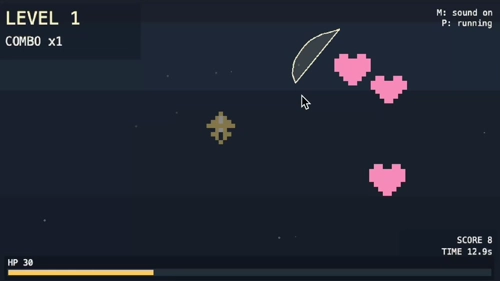

# Lasso Panic

Fast single-screen survival arcade on top of **Vite + TypeScript + Phaser 3** with strict pixel-art rendering.
All sprites are generated in code at runtime (8x8 source pixels), and all SFX are runtime WebAudio tones/noise.



## Goal

Stay alive as long as possible while growing score and combo:

- Health drains continuously.
- Items spawn as **preview ghosts** first, then become **active**.
- Lasso checks **active items only**.
- Same-type selection: remove items, gain score, heal HP.
- Mixed-type selection: items stay, you take damage, combo resets.
- Session ends at `health <= 0`.

## Controls

- `LMB`: draw lasso
- `M`: mute/unmute
- `P`: pause/unpause
- `R`: restart after game over

## Run

```bash
npm i
npm run dev
npm run build
npm run preview
```

## Rules And Progression

- **Spawn cadence ramps up** over time until minimum interval.
- **Unlocked item types increase** with survival time.
- **Item scale gradually shrinks** to increase precision pressure.
- **Combo** increases on successful 2+ item lassos.
- Higher combo boosts heal amount on successful clears.

## HUD And Persistence

HUD shows:

- HP
- Score
- Survival time
- Level
- Combo
- Mute and pause state

Best score and best survival time are saved in `localStorage`.

## Key Tuning (`src/config.ts`)

Main balancing knobs:

- `healthDrainPerSec`, `healPerItem`, `comboHealBonusPerStep`
- `damageBase`, `damagePerWrong`
- `spawnIntervalStartSec`, `spawnIntervalMinSec`, `spawnAccelerationPerSec`
- `startTypes`, `maxTypes`, `typesIncreaseEverySec`
- `itemScaleStart`, `itemScaleMin`, `itemScaleShrinkPerSec`
- `maxItemsSoftCap`, `spawnMinDistancePx`
- `scorePerItem`, `scoreBonusMinGroup`, `scoreBonusStep`, `maxCombo`

Animation knobs:

- `itemHoverAmplitudePx`, `itemHoverSpeedHz`
- `itemActivePulseScale`, `itemActivationBurstScale`
- `itemActivationBurstDurationSec`, `itemCollectDurationMs`

## Preview Capture

For automated recording flows, URL query `?preview=1` auto-starts the run.
This is used to regenerate `docs/game-preview.webp`.

## Notes

Implementation details and agent workflow live in `AGENTS.md`.
